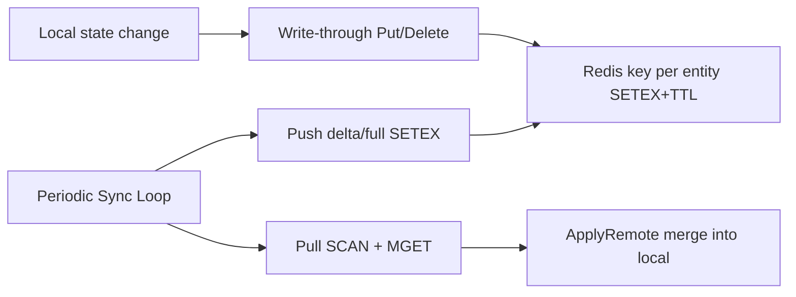
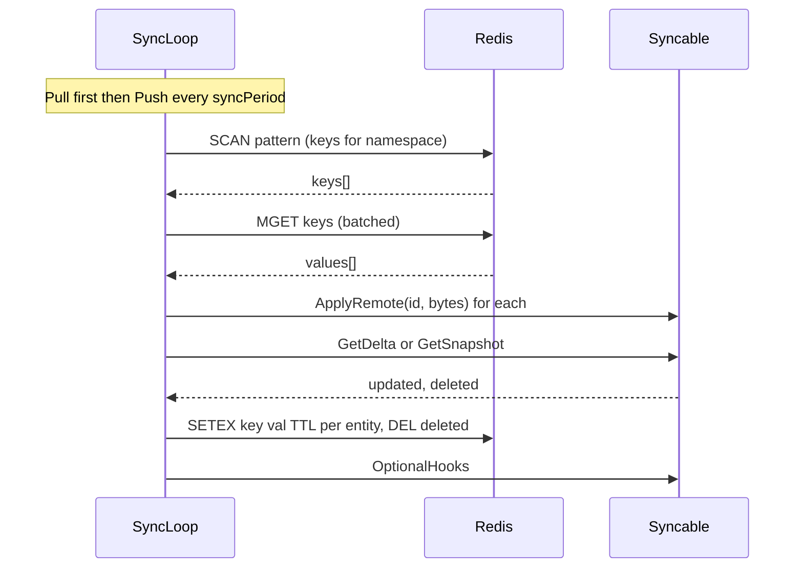

# redissync

Generic Redis-backed state sync for multiple gateway (or other) replicas. Uses **per-entity keys** with `SETEX` (per-record TTL), `MGET` (batched), and `SCAN`/`ISCAN` (enumeration). Keys are tagged with the namespace (`aibrix:{namespace}:e:{id}`) to stay on a single shard in ByteCloud. No PUB/SUB or cross-shard multi-key operations.

- **Periodic sync**: Each replica runs **Pull first** (load from Redis), then **Push** (delta or full) every sync period.
- **Write-through**: After local updates, call `Put`/`Delete` so other replicas see changes on the next pull.
- **Deletions/tombstones**: If a Syncable implements `TombstoneSupport`, deletions are written as tombstones (SETEX) and Pull deletes local entries upon detection; otherwise DEL is used.
- **Jitter and backoff**: Random initial delay and ±20% jitter on interval; exponential backoff (capped) on errors.
- **Lifecycle**: Register all Syncables **before** `Start()`; empty namespace is rejected.

**Per-record TTL:** Each entity is stored as its own key `aibrix:{namespace}:e:{entityId}` with `SETEX` and a 5-minute TTL. So each record expires 5 minutes after it was last written; the TTL window does not slide for other records when one is updated.

Redis key format: `aibrix:{namespace}:e:{entityId}` (hash tag = namespace for same-shard). Namespace must be non-empty.

## Diagrams

### Business Flow


<details>
<summary>Mermaid source (click to expand)</summary>



</details>

### Technical Flow


<details>
<summary>Mermaid source (click to expand)</summary>



</details>

---

## Adopting redissync in a different component

To sync your component’s state across replicas, you need changes **only in the package that owns the state**. The `redissync` package stays generic and does not import your types.

### 1. Implement `syncable.Syncable` in your package

Depend on `github.com/vllm-project/aibrix/pkg/utils/syncable` and implement:

| Method | Purpose |
|--------|--------|
| `Namespace() string` | Stable name for this state (e.g. `"mytracker"`). Used in the Redis key. |
| `GetSnapshot(ctx) (map[string][]byte, error)` | Return current local state as **entity id → serialized bytes**. |
| `ApplyRemote(ctx, id string, data []byte) error` | Apply one entity from Redis into local state (merge or overwrite). |

Optional: implement `syncable.OptionalHooks` for `OnSyncStart` / `OnSyncEnd` (e.g. to batch updates).

### 2. Add serialization for your state

- **Encode**: turn your struct into `[]byte` (e.g. JSON, protobuf). Use a stable format so all replicas can decode.
- **Decode**: in `ApplyRemote`, unmarshal `data` and merge into or replace local state.

### 3. Expose a constructor that returns `syncable.Syncable`

Return an adapter that holds a pointer to your state and implements the interface. Callers will pass this to `redissync.Manager.Register(...)`.

### 4. Wire in the process that runs replicas (e.g. gateway)

- Create `redissync.NewManager(redisClient, redissync.WithSyncPeriod(30*time.Second))` (optional: `WithKeyPrefix`, `WithOpTimeout`).
- **Register** all Syncables **before** `Start()` (Register after Start is ignored).
- `Start()` to begin periodic sync (initial Pull + optional Push, then Pull-first every period with jitter).
- For **write-through**: after mutating local state, call `manager.Sync().Put(ctx, namespace, entityID, serializedBytes)` (and `Delete` when you remove an entity). Namespace must be non-empty.
- On shutdown, `Stop()`.

### Redis client and TLS

The Redis client is provided by the caller (e.g. `utils.GetRedisClient()`). For production, configure TLS and auth in the client options (see `pkg/utils/redis.go`); use `REDIS_HOST`, `REDIS_PORT`, `REDIS_PASSWORD` and ensure the deployment uses TLS where required.

---

## Example: a new component "TokenTracker"

Assume a component that keeps a map `tokenID → lastUsedTime` and should be synced across gateway replicas.

### Step 1 – Implement Syncable in the component package

```go
// pkg/plugins/gateway/algorithms/vtc/token_tracker.go (or your package)

import (
	"context"
	"encoding/json"
	"strconv"
	"time"

	"github.com/vllm-project/aibrix/pkg/utils/syncable"
)

const tokenTrackerNamespace = "token_tracker"

// TokenTrackerSyncable adapts TokenTracker for redissync.
type TokenTrackerSyncable struct {
	Tracker *TokenTracker
}

// NewTokenTrackerSyncable returns a Syncable for the given tracker.
func NewTokenTrackerSyncable(t *TokenTracker) syncable.Syncable {
	return &TokenTrackerSyncable{Tracker: t}
}

func (s *TokenTrackerSyncable) Namespace() string {
	return tokenTrackerNamespace
}

func (s *TokenTrackerSyncable) GetSnapshot(ctx context.Context) (map[string][]byte, error) {
	s.Tracker.mu.RLock()
	defer s.Tracker.mu.RUnlock()
	out := make(map[string][]byte, len(s.Tracker.entries))
	for id, t := range s.Tracker.entries {
		b, _ := json.Marshal(t.UnixNano())
		out[strconv.FormatInt(id, 10)] = b
	}
	return out, nil
}

func (s *TokenTrackerSyncable) ApplyRemote(ctx context.Context, id string, data []byte) error {
	var nano int64
	if err := json.Unmarshal(data, &nano); err != nil {
		return err
	}
	parsed, _ := strconv.ParseInt(id, 10, 64)
	s.Tracker.mu.Lock()
	defer s.Tracker.mu.Unlock()
	if existing, ok := s.Tracker.entries[parsed]; !ok || time.Unix(0, nano).After(existing) {
		s.Tracker.entries[parsed] = time.Unix(0, nano)
	}
	return nil
}
```

### Step 2 – Wire in the gateway (or main)

```go
// Where you create the gateway / server

manager := redissync.NewManager(redisClient, redissync.WithSyncPeriod(30*time.Second))
manager.Register(prefixcacheindexer.NewPrefixHashTableSyncable(prefixHashTable))
manager.Register(vtc.NewTokenTrackerSyncable(tokenTracker))  // new component
manager.Start()
defer manager.Stop()
```

### Step 3 – Write-through when local state changes

```go
// Inside TokenTracker when you update an entry (e.g. RecordUse)

func (t *TokenTracker) RecordUse(id int64, sync *redissync.RedisSync) {
	t.mu.Lock()
	t.entries[id] = time.Now()
	t.mu.Unlock()
	if sync != nil {
		data, _ := json.Marshal(time.Now().UnixNano())
		_ = sync.Put(ctx, tokenTrackerNamespace, strconv.FormatInt(id, 10), data)
	}
}
```

(Alternatively, pass the manager and use `manager.Sync().Put(...)`.)

---

## Reference implementation

- **prefixcacheindexer** in `pkg/utils/prefixcacheindexer/sync.go`:
  - `PrefixHashTableSyncable` and `NewPrefixHashTableSyncable(table)`
  - `GetSnapshotForSync` / `ApplyRemoteForSync` / `EncodeBlockForSync` on `PrefixHashTable` for snapshot, merge, and write-through

Use it as a template for namespace choice, serialization, and merge semantics (e.g. “keep newer” for timestamps).
